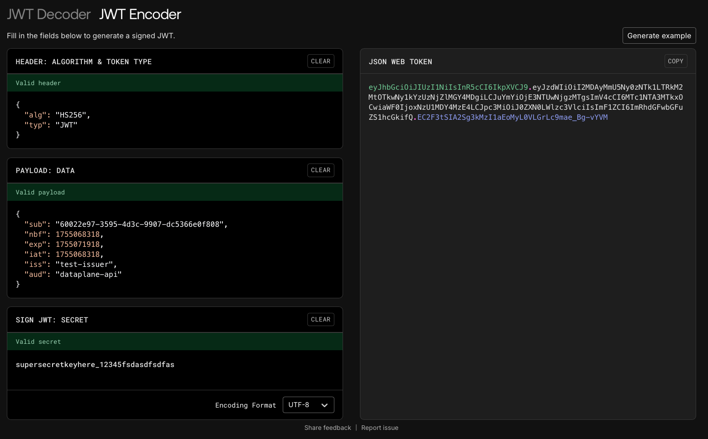

# Using the Example project

This project is a sample web application that uses the Data Plane SDK and the optional API component of the SDK.

## Running the project

Nothing to do, simply execute `dotnet run` in the example project folder or press "run" in your preferred IDE.

## Generating tokens

The example has a function that generates a token and logs it to the console. This might be useful for debugging
purposes, but should not be used in production for obvious reasons.

Tokens can also be generated using JWT.io's JWT Encoder:



The `sub` claim identifies the "user", or "principal" of the token. We will need that when making HTTP requests later.

Please make sure that the `aud` and `iss` claims match the values configured in `appsettings.json`. The temporal claims
`nbf`, `exp` and `iat` must be set such that the token is valid for a reasonable amount of time.

## Making HTTP requests

Using the token generated above, either in code or with JWT.io, you can make HTTP requests to the API:

```shell
ACCESS_TOKEN="eyJhbGciOiJIUzI1NiIsInR5cCI6IkpXVCJ9...."
curl -H "Authorization: Bearer $ACCESS_TOKEN" -X GET http://localhost:5001/api/v1/60022e97-3595-4d3c-9907-dc5366e0f808/dataflows/2347897234/state 
```

This attempts to obtain the state of the dataflow with ID `2347897234` for the user with ID
`60022e97-3595-4d3c-9907-dc5366e0f808`. Most likely, a dataflow with that ID does not exist, so we are expecting a 404
with the following response payload:

```json
{"content":0,"failure":{"message":"Not Found","reason":404}}
```

This tells us, that the token was authenticated, and authorization succeeded, but the requested resource does not
exist. 